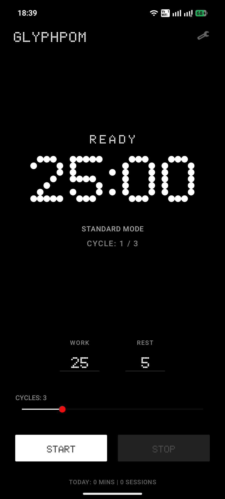
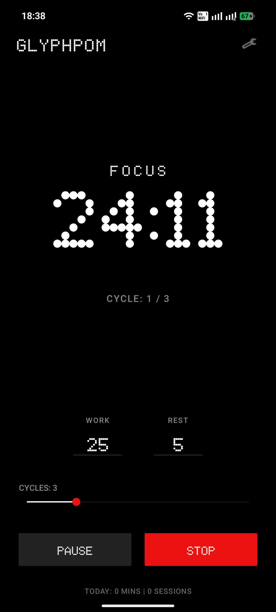
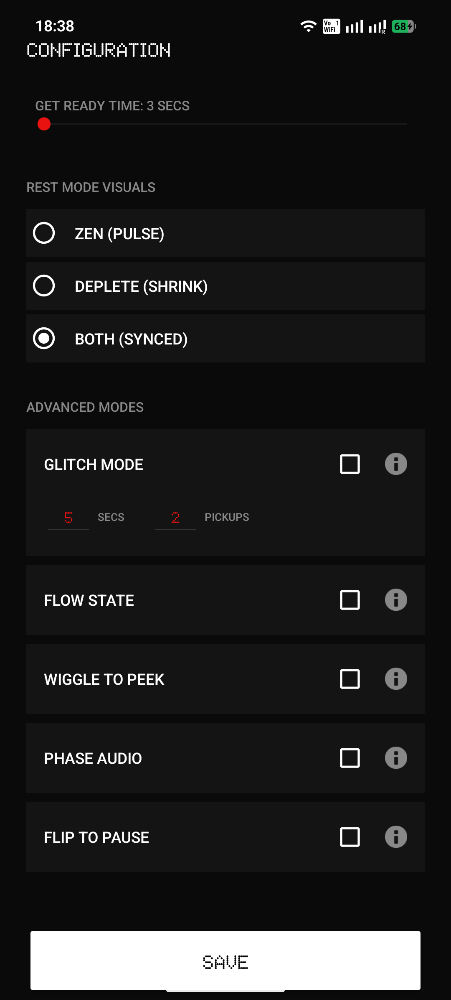

# 🔴 GlyphPom

**A minimalist, hardware-integrated Pomodoro timer for the Nothing Phone ecosystem.**

GlyphPom combines the classic Pomodoro productivity technique with the high-contrast, dot-matrix design language of Nothing OS. It utilizes the **Nothing Ketchum SDK** to provide ambient, non-intrusive feedback via the Glyph Interface.

## ✨ Features (Powered by Hardware)

* **Mathematical Pulse Sync:** During REST mode, the Glyph LEDs perform a "breathing" animation synced to the timer's progress.
* **Glitch Mode (Hardcore):** Uses the accelerometer to detect phone movement. If you pick up your phone during focus, the Glyphs "glitch." Failure to put it back resets the session.
* **Wiggle to Peek:** LEDs remain off to prevent distraction. Give the phone a small nudge to "peek" at your remaining time.
* **Flip to Pause:** Uses the Z-axis sensor to intuitively pause and resume sessions based on phone orientation.
* **Flow State:** Momentum-based mode where focus continues past 00:00 with a calm breathing animation.

## 📸 App Walkthrough

| **Ready Mode** | **Active Focus** | **Advanced Settings** |
| :---: | :---: | :---: |
|  |  |  |
| *Wait for Flip-to-Start* | *Dot-matrix timer UI* | *Green accent rest mode* |

| **Home Page** | **Rest Phase** |
| :---: | :---: |
|  |  |
| *Set your work/rest cycles* | *Toggle hardware features* |

## 🏗 Technical Stack
* **Language:** Kotlin
* **Architecture:** Foreground Service for precise hardware lifecycle management.
* **Hardware SDK:** Nothing Glyph Developer Kit (`com.nothing.ketchum`).
* **UI:** Authentic N-Dot typography and 000000-black design.

## 🚀 Installation
1. Go to the [Releases](https://github.com/ArushCodes/GlyphPom/releases) section of this repository.
2. Download the latest `app-debug.apk`.
3. Sideload the APK onto your Nothing Phone (Ensure "Install from Unknown Sources" is enabled in settings).

## 🤝 Contributing
I built this as my first-ever Android app! If you're a developer and want to improve the LED patterns or add support for more device models, feel free to open a Pull Request.

---
*Created by [Arush](https://github.com/ArushCodes)*
